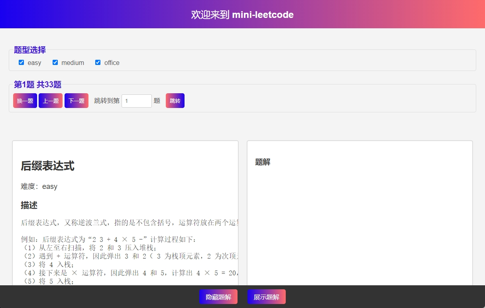

# Mini LeetCode 项目

这是一个精简版的 LeetCode 刷题项目，旨在帮助你学习和练习算法问题。

在线体验：https://jiangmiemie.com/minileetcode/

## 优势

- 开箱即用，无需服务器、无需数据库，只需一个静态网站空间即可部署。

- 结构简单，易于修改，易于自定义题目。

## 路线图

- [√] 增加Head和Foot
- [√] 左右独立窗口
- [√] 题目难度筛选器
- [√] 上一题下一题
- [x] 题解多代码解法可选

## 作者

- jiangyang

## 自用

1. Fork本项目，按source_data中md文件的格式进行修改

> git action 会自动执行`get_source.js` , 将md文件转换为json文件

> 本地使用请手动执行`node get_source.js`，将md文件转换为json文件。推荐VsCode插件`Code Runner`

2. 修改`script.js`中的`apiUrl = 'https://raw.githubusercontent.com/jiangyangcreate/minileetcode/main/data_file.json';`为自己的json文件地址

> 示例：`'https://raw.githubusercontent.com/用户名/项目名/main/文件地址'`

## 许可证

这个项目采用 [MIT 许可证](LICENSE)。

